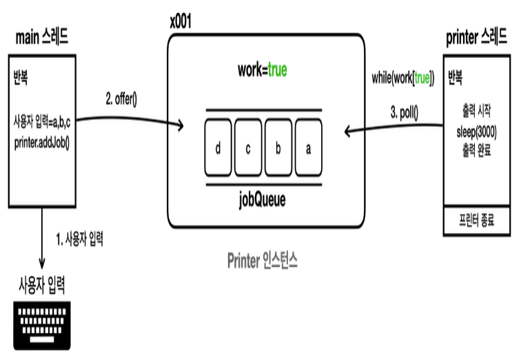
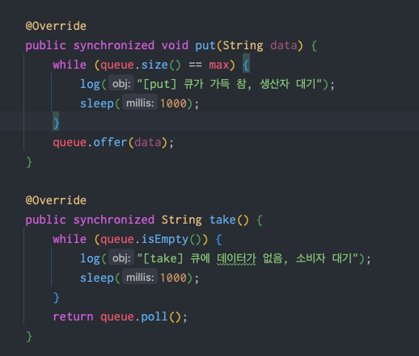
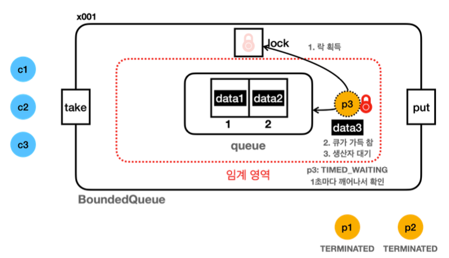
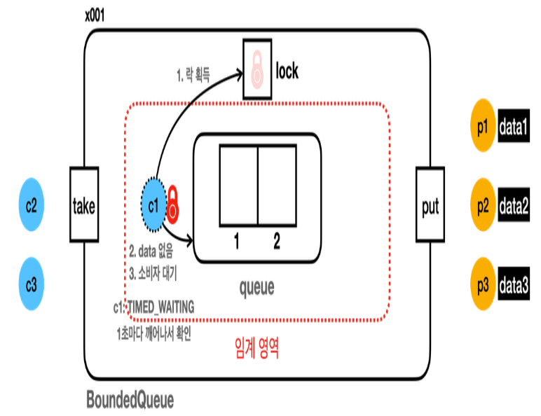

## 생산자 소비자 문제
멀티스레드 프로그래밍에서 자주 등장하는 동시성 문제 중 하나로, 여러 스레드가 동시에
데이터를 생산하고 소비하는 상황


[사진 출처: 김영한의 실전 자바 - 고급 1편](https://www.inflearn.com/course/%EA%B9%80%EC%98%81%ED%95%9C%EC%9D%98-%EC%8B%A4%EC%A0%84-%EC%9E%90%EB%B0%94-%EA%B3%A0%EA%B8%89-1/dashboard)

### 개념
**생산자(Producer)** : 데이터를 생성하는 역할, 데이터를 읽어오거나 네트워크에서 데이터를 받아오는 스레드가 생산자 역할을 할 수 있다.

**소비자(Consumer)** : 생성된 데이터를 사용하는 역할. 예를 들어 데이터를 처리하거나 저장하는 스레드가 소비자 역할을 할 수 있다.

**버퍼(Buffer)** : 생산자가 생성한 데이터를 일시적으로 저장하는 공간


### 생산자 소비자 문제의 가정
- **생산자가 너무 빠를 때**: 버퍼가 가득 차서 더이상 데이터를 넣을 수 없을 때까지 데이터를 생산함.
- **소비자가 너무 빠를 때** : 버퍼가 비어서 더 이상 소비할 데이터가 없을 때까지 소비자가 데이터를 처리함.

**이 문제들은 다음 두 용어로 불린다.**
`생산자 소비자 문제(producer-consumer problem)` 또는
`한정된 버퍼 문제(bounded-buffer problem)` 
---
### 위 문제를 해결하기 위한 예제 문제를 보자.
`BoundedQueue_V1_Main` (생산자 먼저/소비자 먼저) 실행해 볼 것

**이 방식의 문제점** : 버퍼 큐의 공간이 가득 차 `data3` 을 버린다. 그리고 소비자 스레드는 데이터를 받지 못한다.
만약 버퍼가 가득 찼어도 생산자 입장에서는 버퍼에 여유가 생길 때 까지 기다리면 되는데, 기다리지 않고 버리는게 가장 큰 문제다.
이 문제를 해결하기 위한 예제를 보자.


`BoundedQueue_V2_Main` (스레드가 기다리도록 수정) 

`put` 또는 `take`할 공간이 없다면 단순히 `sleep()` 을 이용하여 기다리자.

하지만 우리의 예상과는 달리 `소비자`스레드는 `BLOCKED`상태로 무한 대기하고,
`생산자` 스레드는 소비가 될 때까지 무한 대기한다. (악순환)
왜 이런일이 생기는 걸까?
```java
11:30:52.805 [     main] == [생산자 먼저 실행] 시작, BoundedQueue_V2 ==

11:30:52.806 [     main] 생산자 시작
11:30:52.811 [producer1] [생산 시도] data1 -> []
11:30:52.811 [producer1] [생산 완료] data1 -> [data1]
11:30:52.911 [producer2] [생산 시도] data2 -> [data1]
11:30:52.911 [producer2] [생산 완료] data2 -> [data1, data2]
11:30:53.015 [producer3] [생산 시도] data3 -> [data1, data2]
11:30:53.015 [producer3] [put] 큐가 가득 참, 생산자 대기

11:30:53.120 [     main] 현재 상태 출력, 큐 데이터: [data1, data2]
11:30:53.121 [     main] producer1: TERMINATED
11:30:53.121 [     main] producer2: TERMINATED
11:30:53.121 [     main] producer3: TIMED_WAITING

11:30:53.121 [     main] 소비자 시작
11:30:53.122 [consumer1] [소비 시도]    ? <- [data1, data2]
11:30:53.227 [consumer2] [소비 시도]    ? <- [data1, data2]
11:30:53.333 [consumer3] [소비 시도]    ? <- [data1, data2]

11:30:53.436 [     main] 현재 상태 출력, 큐 데이터: [data1, data2]
11:30:53.436 [     main] producer1: TERMINATED
11:30:53.437 [     main] producer2: TERMINATED
11:30:53.437 [     main] producer3: TIMED_WAITING
11:30:53.437 [     main] consumer1: BLOCKED
11:30:53.437 [     main] consumer2: BLOCKED
11:30:53.437 [     main] consumer3: BLOCKED
11:30:53.437 [     main] == [생산자 먼저 실행] 종료, BoundedQueue_V2 ==
11:30:54.021 [producer3] [put] 큐가 가득 참, 생산자 대기
11:30:55.026 [producer3] [put] 큐가 가득 참, 생산자 대기
11:30:56.031 [producer3] [put] 큐가 가득 참, 생산자 대기
```
이 그림을 한번 보자.

[사진 출처: 김영한의 실전 자바 - 고급 1편](https://www.inflearn.com/course/%EA%B9%80%EC%98%81%ED%95%9C%EC%9D%98-%EC%8B%A4%EC%A0%84-%EC%9E%90%EB%B0%94-%EA%B3%A0%EA%B8%89-1/dashboard)

1. 생산자 스레드인 `p3` 가 생산을 위해 락을 획득하며 임계영역에 들어간다.
2. 큐에 `data3`을 저장하려고 시도하지만 큐가 가득 차있다.
3. sleep(1000) 을 이용하여 `RUNNABLE` -> `TIMED_WAITING` 상태가 된다.
4. 하지만 이미 `p3`스레드가 락을 획득하여 가지고 들어갔기때문에 `소비자` 스레드는 접근 할 수 없어 소비를 할 수 없음
5. 여기서 심각한 무한 대기 문제가 발생

### 참고
```java
    @Override
    public synchronized void put(String data) {
        while (queue.size() == max) {
            log("[put] 큐가 가득 참, 생산자 대기");
            sleep(1000);
        }
        queue.offer(data);
    }

    @Override
    public synchronized String take() {
        while (queue.isEmpty()) {
            log("[take] 큐에 데이터가 없음, 소비자 대기");
            sleep(1000);
        }
        return queue.poll();
    }
```
- `synchronized` 영역은 임계 영역으로 `synchronized(this)` 와 같은 뜻으로 현재 클래스의 락을 공유하고 있다.
---
### 소비자 먼저 시작(V2)

```java
11:42:48.547 [     main] == [소비자 먼저 실행] 시작, BoundedQueue_V2 ==

11:42:48.549 [     main] 소비자 시작
11:42:48.551 [consumer1] [소비 시도]    ? <- []
11:42:48.552 [consumer1] [take] 큐에 데이터가 없음, 소비자 대기
11:42:48.652 [consumer2] [소비 시도]    ? <- []
11:42:48.753 [consumer3] [소비 시도]    ? <- []

11:42:48.857 [     main] 현재 상태 출력, 큐 데이터: []
11:42:48.857 [     main] consumer1: TIMED_WAITING
11:42:48.857 [     main] consumer2: BLOCKED
11:42:48.858 [     main] consumer3: BLOCKED

11:42:48.858 [     main] 생산자 시작
11:42:48.858 [producer1] [생산 시도] data1 -> []
11:42:48.962 [producer2] [생산 시도] data2 -> []
11:42:49.066 [producer3] [생산 시도] data3 -> []

11:42:49.170 [     main] 현재 상태 출력, 큐 데이터: []
11:42:49.171 [     main] consumer1: TIMED_WAITING
11:42:49.171 [     main] consumer2: BLOCKED
11:42:49.171 [     main] consumer3: BLOCKED
11:42:49.171 [     main] producer1: BLOCKED
11:42:49.172 [     main] producer2: BLOCKED
11:42:49.172 [     main] producer3: BLOCKED
11:42:49.172 [     main] == [소비자 먼저 실행] 종료, BoundedQueue_V2 ==
11:42:49.553 [consumer1] [take] 큐에 데이터가 없음, 소비자 대기
11:42:50.558 [consumer1] [take] 큐에 데이터가 없음, 소비자 대기
11:42:51.564 [consumer1] [take] 큐에 데이터가 없음, 소비자 대기
```


[사진 출처: 김영한의 실전 자바 - 고급 1편](https://www.inflearn.com/course/%EA%B9%80%EC%98%81%ED%95%9C%EC%9D%98-%EC%8B%A4%EC%A0%84-%EC%9E%90%EB%B0%94-%EA%B3%A0%EA%B8%89-1/dashboard)

`소비자` 스레드도 마찬가지다.
- `c1` 스레드는 임계영역에 들어가기위해 락을 획득한다.
- `c1` 은 큐의 데이터를 소비하려 했지만 데이터가 없음.
- 무한대기.

---
### 정리
생산자 소비자 문제를 해결하기 위해 단순히, 스레드가 잠깐 sleep() 을 한다면 해결 될 줄 알았던
문제가 더 심각해졌다.
결국 임계 영역 안에서 락을 가지고 대기하는 것이 문제이다.

이 문제를 해결하기 위해선 락을 가진 스레드가 아무일도 하지 않고 대기하는 동안은 잠시 다른스레드에게
락을 양보하는 방법이 있다.
그러면 다른 스레드가 버퍼에 값을 채우거나 버퍼의 값을 가져올 수 있을 것이다.

이 문제를 해결하는 것이 바로 `Object - wait, notify`다. 

`productAndConsumer_2.md` 를 참고
