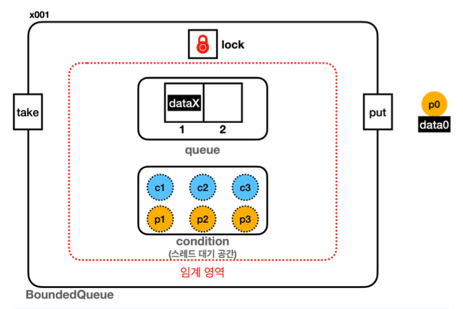

## Lock Condition
`productAndConsumer_2.md` 와 같이 `생산자`가 `생산자`를 꺠우고 `소비자`가 `소비자` 를 꺠우는 비효율적인 방식은
어떻게 해결할 수 있을까?
---
### 해결방법
해결방법은 생각보다 간단하다. `생산자` -> `소비자`,  `소비자` -> `생산자` 의 방식으로 알려주면된다.
`생산자` 스레드가 데이터를 생산하면 `소비자` 스레드가 대기하는 대기 집합에만 알려주고,
`소비자` 스레드가 데이터를 소비하면 `생산자` 스레드가 대기하는 집합에만 알려주면 된다.


대기 집합을 분리하기 위해 앞에서 사용해 본 `Lock`, `ReentrantLock` 를 사용하면 된다.

기존의 `BoundedQueue_V3` 의 코드에서 `synchronized`, `wait()`, `notify()` 대신
`Lock` 인터페이스와 `ReentrantLock` 구현체를 사용해서 바꿔보자
---
## BoundedQueue_V4

### Condition
```java
Condition condition = lock.newCondition();
```
`Condition` 은 `ReentrantLock` 을 사용하는 스레드가 대기하는 스레드 대기 공간이다.
**`lock.newCondition()` 메서드를 호출하면 스레드 대기 공간이 만들어며 `Lock(ReentrantLock) 의 스레드 대기공간은 이렇게 만들 수 있다.**

### condition.await()
**- `Object.wait()`와 비슷한 기능이다. 지정한 `condition` 에 현재 스레드를 대기(`WAITING`)상태로 보관**
**- `ReentrantLock`에서 획득한 락을 반납하고 대기 상태로 `condition` 에 보관**

### condition.signal()
**- `Object.notify()`와 비슷한 기능이다. 지정한 `condition` 에서 대기중인 스레드를 하나 꺠운다.**


[사진 출처: 김영한의 실전 자바 - 고급 1편](https://www.inflearn.com/course/%EA%B9%80%EC%98%81%ED%95%9C%EC%9D%98-%EC%8B%A4%EC%A0%84-%EC%9E%90%EB%B0%94-%EA%B3%A0%EA%B8%89-1/dashboard)
```java
Lock lock = new ReentrantLock();
```
위 그림에서 가장 중요한 부분은 **`lock` 은 `synchronized` 에서 사용한 객체 내부에 있는 모니터 락이 아닌
`ReentrantLock` 락을 뜻한다.**

**`ReentrantLock`은 내부에 락과, 락 획득을 대기하는 스레드를 관리하는 대기 큐가 있다.**
위 그림에서 스레드 대기 공간은 `synchronized`에서 사용하는 스레드 대기 공간이 아니라, 다음 코드를 뜻함
```java
Condition condition = lock.newCondition();
```
---

크게 바뀐 부분은 없어보인다. 단지 `wait()` -> `await()`, `notify()` -> `signal()` 바뀐것 뿐
**구현을 `synchronized`로 했는가 아니면 `ReentrantLock` 을 했는가 차이가 있을 뿐이다.**
---
### 실행 결과
`BoundedQueue_V4_Main` 결과를 보자.
```
11:20:30.676 [     main] == [생산자 먼저 실행] 시작, BoundedQueue_V4 ==

11:20:30.678 [     main] 생산자 시작
11:20:30.684 [producer1] [생산 시도] data1 -> []
11:20:30.684 [producer1] [put] 생산자 데이터 저장, signal() 호출
11:20:30.684 [producer1] [생산 완료] data1 -> [data1]
11:20:30.782 [producer2] [생산 시도] data2 -> [data1]
11:20:30.782 [producer2] [put] 생산자 데이터 저장, signal() 호출
11:20:30.782 [producer2] [생산 완료] data2 -> [data1, data2]
11:20:30.882 [producer3] [생산 시도] data3 -> [data1, data2]
11:20:30.882 [producer3] [put] 큐가 가득 참, 생산자 대기

11:20:30.987 [     main] 현재 상태 출력, 큐 데이터: [data1, data2]
11:20:30.987 [     main] producer1: TERMINATED
11:20:30.987 [     main] producer2: TERMINATED
11:20:30.988 [     main] producer3: WAITING

11:20:30.988 [     main] 소비자 시작
11:20:30.988 [consumer1] [소비 시도]    ? <- [data1, data2]
11:20:30.988 [consumer1] [take] 소비자 데이터 획득, signal() 호출
11:20:30.989 [producer3] [put] 생산자 깨어남
11:20:30.989 [consumer1] 소비 완료] data1 <- [data2]
11:20:30.989 [producer3] [put] 생산자 데이터 저장, signal() 호출
11:20:30.989 [producer3] [생산 완료] data3 -> [data2, data3]
11:20:31.092 [consumer2] [소비 시도]    ? <- [data2, data3]
11:20:31.092 [consumer2] [take] 소비자 데이터 획득, signal() 호출
11:20:31.092 [consumer2] 소비 완료] data2 <- [data3]
11:20:31.197 [consumer3] [소비 시도]    ? <- [data3]
11:20:31.197 [consumer3] [take] 소비자 데이터 획득, signal() 호출
11:20:31.197 [consumer3] 소비 완료] data3 <- []

11:20:31.299 [     main] 현재 상태 출력, 큐 데이터: []
11:20:31.300 [     main] producer1: TERMINATED
11:20:31.300 [     main] producer2: TERMINATED
11:20:31.300 [     main] producer3: TERMINATED
11:20:31.300 [     main] consumer1: TERMINATED
11:20:31.300 [     main] consumer2: TERMINATED
11:20:31.300 [     main] consumer3: TERMINATED
11:20:31.300 [     main] == [생산자 먼저 실행] 종료, BoundedQueue_V4 ==
```
