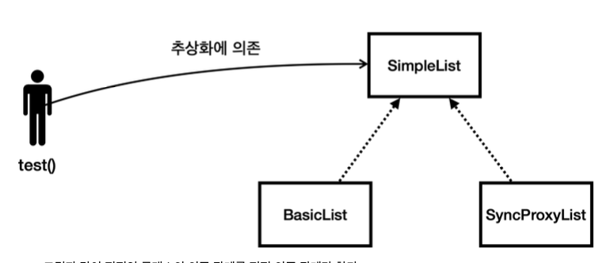

## 동시성 컬렉션이 필요한 이유3 

**synchronized** 추가
```java
    @Override
    public synchronized void add(Object e) {
        elementData[size++] = e;
        sleep(100);
        size++;
    }

    @Override
    public synchronized Object get(int index) {
        return elementData[index];
    }
```
- 앞에서 만들었던 `BasicList` 에 `synchronized` 만 추가했다.

---

`SyncList_Main_1` 

**실행 결과**
```
09:51:11.689 [     main] SyncList
09:51:11.795 [ Thread-1] Thread-1: list.add(A)
09:51:11.901 [ Thread-2] Thread-2: list.add(B)
09:51:11.901 [     main] [A, B] size=2, capacity=5
```
- `synchronizead` 를 통해 임계 영역을 만들었기 때문에 한 번에 하나의 스레드만 `add()` 메서드 수행

---

## 동시성 컬렉션이 필요한 이유4 - 프록시 도입

위의 `SyncList` 클래스 처럼 모든 메서드에 `synchronized` 기능을 추가하여 문제를 해결했지만
그 외의 모든 컬렉션 `ArrayList`, `LinkedList`, `HashSet`, `HashMap` 등의 코드도
모두 복사해서 `Synchronized` 기능을 추가한 코드를 만들어야 할까?
- `ArrayList` -> `SyncArrayList`
- `LinkedList` -> `SyncLinkedList` 처럼..

**이렇게 코드를 복사해서 만들면 이후에 구현이 변경될 때 같은 모양의 코드를 2곳에서 변경해야 한다.**

기존 코드를 그대로 사용하면서 `synchronized` 기능만 추가하고 싶다면 어떻게 하면 좋을까??
예를 들어 `BasicList` 는 그대로 사용하면서, 멀티스레드 상황에 동기화가 필요할 때만
`synchronized` 기능을 살짝 추가하고 싶다면??
---

### 프록시(Proxy)
여기서 프록시가 대신 동기화(`synchronized`) 기능을 처리해주는 것

**소스 코드**
```java
public class SyncProxyList implements SimpleList {

    private SimpleList target;

    public SyncProxyList(SimpleList target) {
        this.target = target;
    }

    @Override
    public synchronized int size() {
        return target.size();
    }

    @Override
    public synchronized void add(Object e) {
        target.add(e);
    }

    @Override
    public synchronized Object get(int index) {
        return target.get(index);
    }

    @Override
    public synchronized String toString() {
        return target.toString() + " by " + this.getClass().getSimpleName();
    }
}
```
- 프록시 역할을 하는 클래스이다.
- `SyncProxyList` 는 `BasicList` 와 같은 `SimpleList` 인터페이스를 구현
- 이 클래스는 생성자를 통해 `SimpleList target` 을 주입 받는다. 여기에 실제 호출되는 대상이 들어감
- 이 클래스의 역할은 모든 메서드에 `synchronized`를 걸어주고 나서, `target` 에 있는 기능을 호출
- 이 프록시 클래스는 `synchronized` 만 걸고, 그 다음에 바로 실제 호출해야 하는 대상(`target`)을 호출한다.

`SyncList_Main_2` 실행결과 동일
---

## 정리


[참조 : 김영한의 실전 자바 - 고급 1편](https://www.inflearn.com/course/%EA%B9%80%EC%98%81%ED%95%9C%EC%9D%98-%EC%8B%A4%EC%A0%84-%EC%9E%90%EB%B0%94-%EA%B3%A0%EA%B8%89-1/dashboard)


**프록시 정리**
- 프록시인 `SyncProxyList` 는 원본인 `BasicList` 와 똑같은 `SimpleList` 를 구현한다.
  따라서 클라이언트인 `test()` 입장에서는 원본 구현체가 전달되든, 아니면 프록시 구현체가 전달되든 상관이 없다.
  단지 수 많은 `SimpleList` 의 구현체 중의 하나가 전달되었다고 생각할 뿐

- 클라이언트 입장에서 보면 프록시는 원본과 똑같이 생겼고, 호출할 메서드도 똑같다. 단지 `SimpleList` 구현체일 뿐이다.
- 프록시 내부에 원본을 가지고 있다. 그래서 프록시가 필요한 일부의 일을 처리하고, 그다음에 원복을 호출하는 구조를 만들 수 있다.
  여기 프록시는 `synchronized` 를 통한 동기화를 적용한다.
- 프록시가 동기화를 적용하고 원본을 호출하기 때문에 원본 코드도 이미 동기화가 적용된 상태로 호출


**여기서 중요한 핵심은** 원본 코드인 `BasicList`를 전혀 손대지 않고, 프록시인 `SyncProxyList` 를 통해
동기화 기능을 적용했다는 점이다.
또한, `SimpleList`를 구현한 `BasicLinkedList` 같은 연결 리스트를 만들더라도 서로 같은 인터페이스를 사용하기 때문에
`SyncProxyList`를 그대로 활용할 수 있다.

---
## 프록시 패턴
**프록시 패턴(Proxy Pattern)** 은  객체지향 디자인 패턴 중 하나다.
**어떤 객체에 대한 접근을 제어하기 위해 그 객체의 대리인 또는 인터페이스 역할을 하는 개체를 제공하는 패턴**

### 프록시 패턴의 주요 목적
- **접근 제어**: 실제 객체에 접근을 제한하거나 통제할 수 있다.
- **성능 향상**: 실제 객체의 생성을 지연시키거나 캐싱하여 성능을 최적화할 수 있다.
- **부가 기능 제공**: 실제 객체에 추가적인 기능(로깅, 인증, 동기화)을 투명하게 제공할 수 있다.

### 참고
실제 프록시 패턴은 자주 사용된다. 스프링의 `AOP` 기능은 사실 이런 프록시 패턴을 극한으로 적용한 예이다.

---

## synchronized 프록시 방식의 단점
1. 동기화 오버헤드가 발생한다. 비록 `synchronized` 키워드가 멀티스레드 환경에서 안전한 접근을 보장하지만,
   각 메서드 호출 시마다 동기화 비용이 추가 된다. 이로 인해 성능 저하 발생
2. 전체 컬렉션에 대해 동기화가 이루어지기 때문에, 잠금 범위가 넓어질 수 있다.
3. 정교한 동기화가 불가능하다. `synchronized`프록시를 사용하면 **컬렉션 전체**에 대한 동기화가 이루어지지만,
   특정 부분이나 메서드에 대해 **선택적으로 동기화를 적용하는 것은 어렵다.** 이는 과도한 동기화로 이어질 수 있다.

**쉽게 이야기 해서 이 방식은 단순 무식하게 모든 메서드에 `synchronized`를 걸어버리는 것**
**자바는 이런 단점을 보완하기 위해 `java.util.concurrent` 패키지에 동시성 컬렉션을 제공한다.**
