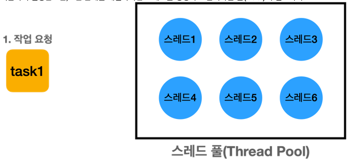
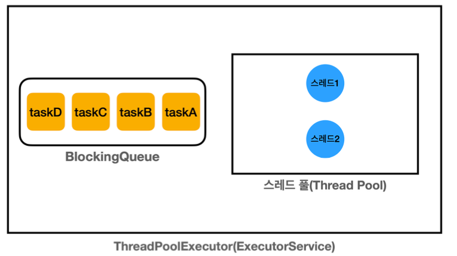

## 해결 방법

**지금까지 이야기한 `executor_1.md` 의 1번, 2번 문제를 해결하려면 스레드를 생성하고 관리하는 `풀(pool)`이 필요하다.


[사진 출처: 김영한의 실전 자바 - 고급 1편](https://www.inflearn.com/course/%EA%B9%80%EC%98%81%ED%95%9C%EC%9D%98-%EC%8B%A4%EC%A0%84-%EC%9E%90%EB%B0%94-%EA%B3%A0%EA%B8%89-1/dashboard)

1. 스레드를 관리하는 스레드 풀에 스레드를 미리 필요한 만큼 만들어둔다.
2. 스레드는 스레드 풀에서 대기하며 쉰다.
3. 작업 요청이 온다.
4. 스레드 풀에서 이미 만들어진 스레드를 하나 조회한다.
5. 조회한 스레드 하나로 작업을 처리한다.
6. 작업을 완료한다.
7. 작업을 완료한 스레드는 종료하는게 아니라, 다시 스레드 풀에 반납한다.(이후 재사용)


위의 그림을 보면 알겠지만 `스레드 풀` 이라는것은 그냥 컬렉션에 스레드를 보관하고 재사용할 수 있게 하면 된다.
하지만 스레드 풀에 있는 스레드는 처리할 작업이없다면 `대기(WAITING)` 상태로 관리해야 하고,
작업 요청이 오면 `RUNNABLE` 상태로 변경해야 된다. 이것을 직접 구현하려고 한다면 생각보다
매우 복잡할 것이다. 거기다가 `생산자` `소비자` 문제까지 겹치면 엄청 복잡해진다.
왜냐하면 스레드 풀에있는 어떤 스레드 하나가 생산자이면서 소비자이기 때문이다.

---
## Executor 프레임워크

`Executor` 프레임워크는 `스레드 풀`, `스레드 관리`, `Runnable` 의 문제점은 물론이고,
생산자 소비자 문제까지 한방에 해결해주는 자바 멀티스레드 최고의 도구이다.

**지금까지 학습했던 멀티스레드 기술의 총 집합이 여기에 들어있다.**

스레드를 직접 생성해서 사용하게 된다면, 생각보다 고려해야 할 일이 많다.
그래서 실무에서는 스레드를 직접 하나하나 생성해서 사용하는 일은 드물다.
---
## Executor 프레임워크 소개

**Executor 인터페이스**
```java
public interface Executor {
    void execute(Runnable command);
}
```
- 가장 단순한 작업 실행 인터페이스로, `execute(Runnable command)` 메서드를 하나 가지고 있다.


**ExecutorService 인터페이스 - 주요 메서드**
```java
public interface ExecutorService extends Executor, AutoCloseable {
    void shutdown();

    List<Runnable> shutdownNow();

    boolean isShutdown();

    boolean isTerminated();

    boolean awaitTermination(long var1, TimeUnit var3) throws InterruptedException;

    <T> Future<T> submit(Callable<T> var1);

    <T> Future<T> submit(Runnable var1, T var2);

    Future<?> submit(Runnable var1);

    <T> List<Future<T>> invokeAll(Collection<? extends Callable<T>> var1) throws InterruptedException;

    <T> List<Future<T>> invokeAll(Collection<? extends Callable<T>> var1, long var2, TimeUnit var4) throws InterruptedException;

    <T> T invokeAny(Collection<? extends Callable<T>> var1) throws InterruptedException, ExecutionException;

    <T> T invokeAny(Collection<? extends Callable<T>> var1, long var2, TimeUnit var4) throws InterruptedException, ExecutionException, TimeoutException;

    default void close() {
        boolean terminated = this.isTerminated();
        if (!terminated) {
            this.shutdown();
            boolean interrupted = false;

            while(!terminated) {
                try {
                    terminated = this.awaitTermination(1L, TimeUnit.DAYS);
                } catch (InterruptedException var4) {
                    if (!interrupted) {
                        this.shutdownNow();
                        interrupted = true;
                    }
                }
            }

            if (interrupted) {
                Thread.currentThread().interrupt();
            }
        }

    }
}
```
- `Executor` 인터페이스를 확장해서 작업 제출과 제어 기능을 추가로 제공
- 주요 메서드로는 `submit()`, `close()` 가 있다.
- `Executor` 프레임워크를 사용할 때는 대부분 이 인터페이스를 사용한다.


**ExecutorService 인터페이스의 기본 구현체는 `ThreadPoolExecutor` 이다.**

---
### 로그 출력 유틸리티 만들기
**먼저 `Executor` 프레임워크의 상태를 확인하기 위한 로그 출력 유틸리티를 만들어두자**
```java
public abstract class ExecutorUtils {

    public static void printState(ExecutorService executorService) {

        if (executorService instanceof ThreadPoolExecutor poolExecutor) {

            // 스레드 풀에서 관리되는 스레드의 숫자
            int pool = poolExecutor.getPoolSize();
            // 작업을 수행하는 스레드의 숫자
            int active = poolExecutor.getActiveCount();
            // 큐에 대기중인 작업의 숫자
            int queuedTasks = poolExecutor.getQueue().size();
            // 완료된 작업의 숫자
            long completedTask = poolExecutor.getCompletedTaskCount();

            log("[pool=" + pool + ", active=" + active + ", queuedTasks=" + queuedTasks + ", completedTasks=" + completedTask + "]");
        } else {
            log(executorService);
        }
    }
}
```

---
### ExecutorService 간단한 코드 시작

`RunnableTask_1_Main`


**ExecutorService 의 대표적인 구현체 ThreadPoolExecutor** 다음 그림을 보자.

[사진 출처: 김영한의 실전 자바 - 고급 1편](https://www.inflearn.com/course/%EA%B9%80%EC%98%81%ED%95%9C%EC%9D%98-%EC%8B%A4%EC%A0%84-%EC%9E%90%EB%B0%94-%EA%B3%A0%EA%B8%89-1/dashboard)

**위 그림과 같이 ThreadPoolExecutor(ExecutorService) 는 크게 2가지 요소로 구성**
- **스레드 풀**: 스레드를 관리한다.
- **BlockingQueue**: 작업을 보관한다. 생산자 소비자 문제를 해결하기 위해 단순한 큐가 아니라,
                     `BlockingQueue` 를 사용한다.


생산자가 `es.execute(new RunnableTask("taskA"))`를 호출하면, `RunnableTask("taskA") 인슽건스가
`BlockingQueue` 에 보관된다.

- **생산자**: `es.execute(작업)`를 호출하면 내부에서 `BlockingQueue`에 작업을 보관한다. 메인 스레드가 생산자가 된다.
- **소비자**: 스레드 풀에 있는 스레드가 소비자이다. 이후에 소비자 중에 하나가 `BlockingQueue`에 들어있는 작업을 받아서 처리한다.
---
### ThreadPoolExecutor 생성자
```java
    public ThreadPoolExecutor(int corePoolSize,
                              int maximumPoolSize,
                              long keepAliveTime,
                              TimeUnit unit,
                              BlockingQueue<Runnable> workQueue) {
        this(corePoolSize, maximumPoolSize, keepAliveTime, unit, workQueue,
             Executors.defaultThreadFactory(), defaultHandler);
    }
```
- `corePoolSize`: 스레드 풀에서 관리되는 기본 스레드의 수
- `maximumPoolSize`: 스레드 풀에서 관리되는 최대 스레드 수
- `keepAliveTime`, `TimeUnit`, `unit`: 기본 스레드 수를 초과해서 만들어진 스레드가 생존할 수 있는 대기 시간.
                                       이 시간 동안 처리할 작업이 없다면 초과 스레드는 제거된다.
- `BlockingQueue workQueue`: 작업을 보관할 블로킹 큐
---

### RunnableTask_1_Main 소스 중 일부
```java
ThreadPoolExecutor es = 
        new ThreadPoolExecutor(2, 2, 0, TimeUnit.MILLISECONDS, new LinkedBlockingQueue<>());
```
- `corePoolSize=2`, `maximumPoolSize=2` 를 사용해 기본 스레드와 최대 스레드 수를 맞춤
따라서 풀에서 관리되는 스레드는 2개로 고정된다.

- 작업을 보관할 블로킹 큐의 구현체로 `LinkedBlockingQueue` 를 사용했으며, 이 블로킹 큐는 작업을 무한대로 저장할 수 있다.


### 실행 결과
```
10:14:40.211 [     main] === 초기 상태 ===
10:14:40.221 [     main] [pool=0, active=0, queuedTasks=0, completedTasks=0]
10:14:40.222 [     main] === 작업 수행 중 ===
10:14:40.223 [     main] [pool=2, active=2, queuedTasks=2, completedTasks=0]
10:14:40.223 [pool-1-thread-1] taskA 시작
10:14:40.223 [pool-1-thread-2] taskB 시작
10:14:41.229 [pool-1-thread-1] taskA 완료
10:14:41.229 [pool-1-thread-2] taskB 완료
10:14:41.230 [pool-1-thread-1] taskC 시작
10:14:41.230 [pool-1-thread-2] taskD 시작
10:14:42.235 [pool-1-thread-2] taskD 완료
10:14:42.235 [pool-1-thread-1] taskC 완료
10:14:43.229 [     main] [pool=2, active=0, queuedTasks=0, completedTasks=4]
10:14:43.230 [     main] === shutdown 완료 ===
10:14:43.231 [     main] [pool=0, active=0, queuedTasks=0, completedTasks=4]
```
