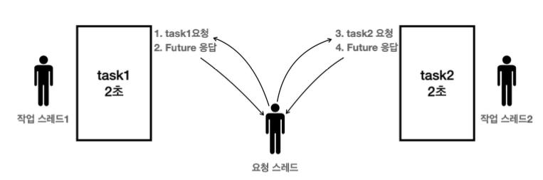

## Future - 분석

**다음 코드를 보자**
```java
Future<Integer> future = es.submit(new MyCallable());
```
- `submit()` 의 호출로 `MyCallable`의 인스턴스를 전달한다.
- 이때 반환값을 보면 숫자 대신에 `Future` 객체를 반환한다.
- 생각해보면 `MyCallable` 이 즉시 실행되어서 즉시 결과를 반환하는 것은 불가능하다.
  왜냐하면 `MyCallable`은 즉시 실행되는 것이 아니다. 스레드 풀의 스레드가 미래의 어떤 시점에 이 코드를 대신 실행해야 한다.
- `MyCallable.call()` 메서드는 호출 스레드가 실행하는 것도 아니고, 스레드 풀의 다른 스레드가 실행하기 때문에
  언제 실행이 완료되어서 결과를 반환할 지 알 수 없다.
- 따라서 결과를 즉시 받는 것은 불가능하다. 이런 이유로 `es.submit()`은 `MyCallable`의 결과를 
  반환하는 대신에 `MyCallable`의 결과를 나중에 받을 수 있는 `Future` 라는 객체를 대신 제공한다.
- 정리하면 `Future` 는 전달한 작업의 미래이다. 이 객체를 통해 전달한 작업의 미래 결과를 받을 수 있다.

---
### Future - 어떻게 작동하는가?

`Callable_2_Main` 실행결과를 보자
```java
11:21:46.163 [     main] submit() 호출
11:21:46.165 [pool-1-thread-1] Callable 시작
11:21:46.166 [     main] future 즉시 반환, future = java.util.concurrent.FutureTask@6576fe71[Not completed, task = thread._14_executor.Callable_2_Main$MyCallable@7eda2dbb]
11:21:46.166 [     main] future.get() [블로킹] 메서드 호출 시작 -> main 스레드 WAITING
11:21:48.174 [pool-1-thread-1] create value = 9
11:21:48.175 [pool-1-thread-1] Callable 완료
11:21:48.176 [     main] future.get() [블로킹] 메서드 호출 완료 -> main 스레드 RUNNABLE
11:21:48.177 [     main] result value = 9
11:21:48.178 [     main] future 완료, future = java.util.concurrent.FutureTask@6576fe71[Completed normally]
```


### 정리
```java
Future<Integer> future = es.submit(new MyCallable());
```
- `Future`는 작업의 미래 결과를 받을 수 있는 개체이다.
- `submit()`호출 시 `future` 는 즉시 반환된다. 덕분에 요청 스레드(`main`)는 블로킹 되지 않고,
  필요한 작업을 할 수 있다.


```java
Integer result = future.get();
```
- 작업 결과가 필요하면 `Future.get()` 을 호출하면 된다.
- **Future 가 완료 상태**: `Future`가 완료 상태면 `Future`에 결과도 포함되어 있다. 이 경우 요청 스레드는 대기하지 않고, 값을 즉시 받는다.
- **Future 가 완료 상태가 아님**: 작업이 아직 수행되지 않았거나 또는 수행중으로, 이때는 어쩔 수 없이 요청 스레드가 결과를 받기 위해 블로킹 상태로 대기

---
### Future 가 필요한 이유?

**다음 두 코드를 비교 해보자**

### Future 를 반환 하는 코드
```java
// 블로킹 아님
Future<Integer> future = es.submit(new MyCallable());
// 블로킹
future.get();
```

### 결과를 직접 반환 하는 코드
```java
// 블로킹
Integer result = es.submit(new MyCallable());
```

**둘 다 작업의 결과를 받을 때 까지 요청 스레드는 대기해야한다.** 
`Future` 도  future 만 즉시 반환 받을 뿐이지, 결과를 얻으려면 결국 `future.get()`을 호출 해야한다.

---
## Future - 활용
**1~100 까지 더하는 경우를 스레드를 사용해서 `1~50`, `51~100`으로 나누어 처리해보는 코드를 만들어보자

`SumTask_1_Main` 소스를 실행 해보자

(`ExecutorService`없이 `Runnable` 과 순수 스레드로 수행 테스트)
### 실행 결과
```java
09:00:52.154 [ thread-1] 작업 시작
09:00:52.154 [ thread-2] 작업 시작
09:00:52.154 [     main] join() - main 스레드가 thread1, thread2 종료 까지 대기
09:00:54.165 [ thread-2] 작업 완료 result = 3775
09:00:54.166 [ thread-1] 작업 완료 result = 1275
09:00:54.167 [     main] main 스레드 대기 완료
09:00:54.167 [     main] task1.result=1275
09:00:54.168 [     main] task2.result=3775
09:00:54.168 [     main] task1 + task2 = 5050
09:00:54.168 [     main] End
```
---

### Callable 을 사용
**(앞의 코드를 `Callable` 과 `ExecutorService`로 처리해보자.)

`SumTask_2_Main` 실행해보자

### 실행 결과
```java
09:07:36.584 [pool-1-thread-2] 작업 시작
09:07:36.584 [pool-1-thread-1] 작업 시작
09:07:38.588 [pool-1-thread-2] 작업 완료 result=3775
09:07:38.591 [pool-1-thread-1] 작업 완료 result=1275
09:07:38.591 [     main] task1.result=1275
09:07:38.592 [     main] task2.result=3775
09:07:38.592 [     main] task1 + task2 = 5050
09:07:38.592 [     main] END
```

`SumTask_1_Main` 과 `SumTatsk_2_Main` 을 비교해보면 `Callable`을 사용한 덕분에, 이전 코드보다
훨씬 직과적이고 깔끔하게 코드가 바뀐 것 같다.
특히 작업의 결과를 반환하고, 요청 스레드에서 그 결과를 바로 받아서 처리하는 부분이 매우 직관적이다.
그리고 또 **`Thread.join()`과 같은 스레드를 관리하는 코드도 모두 제거할 수 있다.**
추가로 `Callable.call()`은 **throws InterruptedException** 과 같은 체크 예외도 던질 수 있다.

**하지만 코드가 직관적으로 바뀌고 체크 예외를 던질 수 있다고해도 이것만으로는 `Future`가 필요한 이유가 부족하다.**

---
## Future - 필요한 이유

**자 다시 한번 더 두 코드를 비교해보자**

### Future 를 반환 하는 코드
```java
Future<Integer> future1 = es.submit(task1); // 블로킹 아님
Future<Integer> future2 = es.submit(task2); // 블로킹 아님

Integer sum1 = future1.get(); // 블로킹
Integer sum2 = future2.get(); // 블로킹
```

### Future 없이 결과를 직접 반환 하는 코드(가정이고 이런 코드는 없음)
```java
Integer sum1 = es.submit(task1); // 블로킹
Integer sum2 = es.submit(task2); // 블로킹
```


[사진 출처: 김영한의 실전 자바 - 고급 1편](https://www.inflearn.com/course/%EA%B9%80%EC%98%81%ED%95%9C%EC%9D%98-%EC%8B%A4%EC%A0%84-%EC%9E%90%EB%B0%94-%EA%B3%A0%EA%B8%89-1/dashboard)

**먼저 `ExecutorService` 가 `Future`없이 결과를 직접 반환한다고 가정해보자.**
- 요청 스레드는 task1 을 `ExecutorService`에 요청하고 결과를 기다린다.
  - 작업 스레드가 작업을 수행하는데 2초가 걸린다.
  - 요청 스레드는 결과를 받을 때 까지 2초간 대기한다.
  - 요청 스레드는 2초 후에 결과를 받고 다음 라인을 수행한다.
- 요청 스레드는 task2 을 `ExecutorService` 에 요청하고 결과를 기다린다.
  - 작업 스레드가 작업을 수행하는데 2초가 걸린다.
  - 요청 스레드는 결과를 받을 때 까지 2초간 대기한다.
  - 결과를 받고 요청 스레드가 다음 라인을 수행한다.

이처럼, `Future`를 사용하지 않는 경우 결과적으로 `task1` 의 결과를 기다린 다음에 `task2` 를 요청한다.
따라서 총 **4초의 시간**이 걸렸다. 이것은 단일 스레드가 작업한 것과 비슷한 결과다.

---
**다음으로 `Future`를 반환한다고 가정해보자.**


[사진 출처: 김영한의 실전 자바 - 고급 1편](https://www.inflearn.com/course/%EA%B9%80%EC%98%81%ED%95%9C%EC%9D%98-%EC%8B%A4%EC%A0%84-%EC%9E%90%EB%B0%94-%EA%B3%A0%EA%B8%89-1/dashboard)

- 요청 스레드는 task1 을 `ExecutorService`에 요청한다.
  - 요청 스레드는 즉시 `Future`를 반환받는다.
  - 작업 스레드는 즉시 `task1`을 수행한다.
- 요청 스레드는 task2 를 `ExecutorService`에 요청한다.
  - 요청 스레드는 즉시 `Future`를 반환받는다.
  - 작업 스레드2는 `task2`를 수행한다.

**요청 스레드는 `task1`, `task2`를 동시에 요청할 수 있다. 따라서 두 작업은 동시에 수행된다.**

---
## Future - 잘못 사용하는 예

### Future 를 적절하게 잘 활용
```java
Future<Integer> future1 = es.submit(task1); // non-blocking
Future<Integer> future2 = es.submit(task2); // non-blocking

Integer sum1 = future1.get(); // blocking, 2초 대기
Integer sum2 = future2.get(); // blocking, 즉시 반환
```
- 요청 스레드가 필요한 작업을 모두 요청한 다음에 결과를 받는다.
- 총 2초의 시간이 걸린다.


### Future 를 잘못 활용한 예1
```java
Future<Integer> future1 = es.submit(task1);
Itneger sum1 = future1.get();

Future<Integer> future2 = es.submit(task2);
Itneger sum2 = future2.get();
```
- 요청 스레드가 작업을 하나 요청하고 그 결과를 기다린다. 그리고 2초를 기다린 후 다시 두 번째 스레드 요청을 전달하고 또 2초를 기다린다.
- 총 4초의 시간이 걸림


### Future 를 잘못 활용한 예 2
```java
Integer sum1 = es.submit(task1).get();
Integer sum2 = es.submit(task2).get();
```
- Future 를 잘못 활용한 예1과 똑같은 코드다. 대신에 `submit()`을 호출하고 그 결과를 변수에 담지 않고 바로 연결해서 `get()`을 호출한다.
- 총 4초의 시간이 걸림

---
### 정리

- `Future` 라는 개념이 없다면 결과를 받을 때 까지 요청 스레드는 아무일도 못하고 대기해야 한다.
- `Future` 라는 개념 덕분에 요청 스레드는 대기하지 않고, 다른 작업을 수행할 수 있다.
  예를 들어서 다른 작업을 더 요청할 수 있다. 그리고 모든 작업 요청이 끝난 다음에, 본인이 필요할 때 `Future.get()`을 호출해서 최종 결과를 받을 수 있다.
- `Future`를 사용하는 경우 결과적으로 `task1`, `task2` 를 동시에 요청할 수 있다. 두 작업을 바로 요청했기 때문에 작업을 동시에 수행할 수 있다.


`Future`는 요청 스레드를 블로킹(대기)상태로 만들지 않고, 필요한 요청을 모두 수행할 수 있게 해준다.
필요한 요청을 한 다음에 `Future.get()`을 통해 블로킹 상태로 대기하며 결과를 받으면 된다.
이런 이유로 `ExecutorService`는 결과를 직접 반환하지 않고, `Future` 를 반환한다.

---

