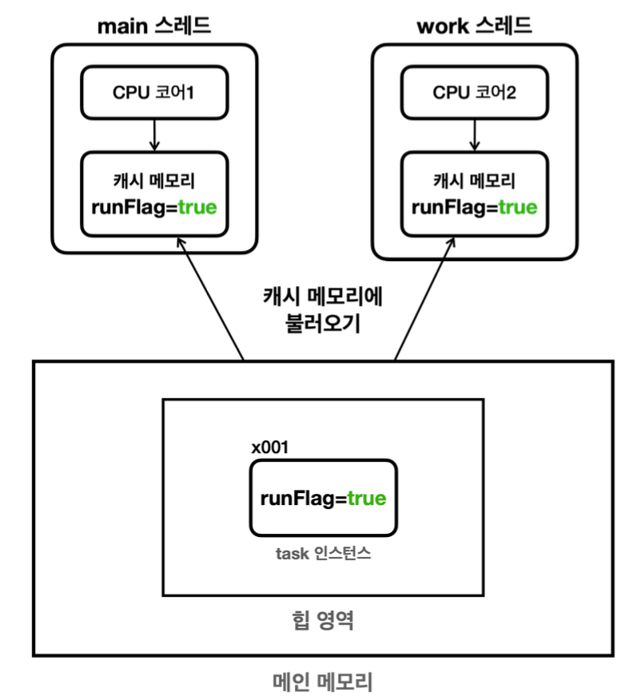

## 메모리 가시성 문제

### Volatile_V1 에서 우리가 기대하는 실행 결과
```java
09:52:29.918 [     main] flag = true
09:52:29.920 [     work] task 시작
09:52:30.925 [     main] flag 를 false 로 변경 시도
09:52:30.926 [     main] flag = false
09:52:30.938 [     work] task 종료
09:52:30.926 [     main] main 종료
```

### 실제 실행 결과
```java
09:52:29.918 [     main] flag = true
09:52:29.920 [     work] task 시작
09:52:30.925 [     main] flag 를 false 로 변경 시도
09:52:30.926 [     main] flag = false
09:52:30.926 [     main] main 종료
```


### 왜 이런 문제가 발생할까?
`main` 스레드와 `work`스레드는 각각의 CPU 코어에 할당되어 실행되는데
자바 프로그램의 시작 시점에는 `flag`를 변경하지 않기 때문에
모든 스레드에서 `true`의 값으로 읽는다.

우리가 예상한 흐름은 `main`스레드가 `flag`의 값을 `false` 로 설정한다면
메인 메모리의 `flag`값이 `false` 로 변경되고 `work` 스레드는 
변경된 값을 확인하고 while 문에서 탈출 후 `task 종료` 를 출력한다. 일 것이다.
하지만 실제로는 이런 방식으로 작동하지 않는다.


### 실제 메모리 접근 방식
CPU 연산은 매우 빠르기 때문에 CPU 연산의 빠른 성능을 따라가려면,
메인 메모리는 상대적으로 느리다. 그래서 빠른 메모리가 필요한데
그것이 바로 `캐시 메모리`이다. 
현대의 대부분의 CPU 는 코어 단위로 `캐시 메모리`를 보유하고 있다.

[참조 : 김영한의 실전 자바 - 고급 1편](https://www.inflearn.com/course/%EA%B9%80%EC%98%81%ED%95%9C%EC%9D%98-%EC%8B%A4%EC%A0%84-%EC%9E%90%EB%B0%94-%EA%B3%A0%EA%B8%89-1/dashboard)

그림에서 보다싶이 각 스레드가 `flag`의 값을 사용하면 CPU 는 이 값을 효율적으로
처리하기 위해 먼저 `flag`를 캐시 메모리에 불러온다.
그리고 이후에 캐시 메모리에 있는 `flag` 값을 사용하게 된다.

그러면 여기서 우리가 알 수 있는 것은 `main`스레드가 `flag` 값을 `false`로 바꿔도
`캐시 메모리`의 `flag` 값만 `false` 로 바뀌는 것이다.

`work`스레드에 있는 캐시 메모리는 여전히 `flag`값은 여전히 `true` 이다.

### 캐시 메모리에 있는 `flag` 값은 언제 메인 메모리에 반영될까?
**알 수 없다.** CPU 의 설계방식과 종류에 따라 전부 다르다고 보면 된다.
메인 메모리에 반영된다고 해도, 이 메인 메모리에 반영된 `flag` 값을
다시 `work`스레드의 캐시 메모리에 불러와야 한다.

보통 `컨텍스트 스위칭`이 될 때, 캐시 메모리도 함깨 갱신되는데, 이 부분도
상황에 따라 달라질 수 있다.
---
## 메모리 가시성 (memory visibility)
위처럼 멀티스레드 환경에서 한 스레드가 변경한 값이 다른 스레드에서 
언제 보이는지에 대한 문제를 `메모리 가시성`이라 한다.
이름 그대로 메모리에 변경한 값이 보이는가, 보이지 않는가의 문제이다.
---
### 그러면 한 스레드에서 변경한 값이 다른 스레드에서 바로 보이게 하려면?
캐시 메모리를 사용하면 CPU 처리 성능을 개선할 수 있지만 멀티 스레드에서 같은
시점에 정확히 같은 데이터를 보는 것이 더 중요할 수 있다.
해결방안은 아주 단순하다.
성능을 약간 포기하는 대신에 `메인 메모리`에 직접 접근하면 된다.
자바에서는 `volatile`이라는 키워드로 이런 기능을 제공한다.
---
## Java Memory Model

### 메모리 가시성
멀티스레드 환경에서 한 스레드가 변경한 값이 다른 스레드에서
언제 보이는지에 대한 것을 메모리 가시성이라 한다.

### Java Memory Model
자바 프로그램이 어떻게 메모리에 접근하고 수정할 수 있는지 규정하며,
특히 멀티스레드 프로그래밍에서 스레드 간의 상호작용을 정의
핵심은 여러 스레드들의 작업 순서를 보장하는 happens-before 관계에 대한 정의다.

### happens-before
자바 메모리 모델에서 스레드 간의 작업 `순서를 정의한 개념`
만약 `A 작업`이 `B 작업`보다 `happens-before` 관계에 있다면, 
A 작업에서의 모든 메모리 변경 사항은 B 작업에서 볼 수 있다. 
즉, `A 작업`에서 변경된 내용은 `B 작업`이 시작되기 전에 모두 메모리에 반영된다.
