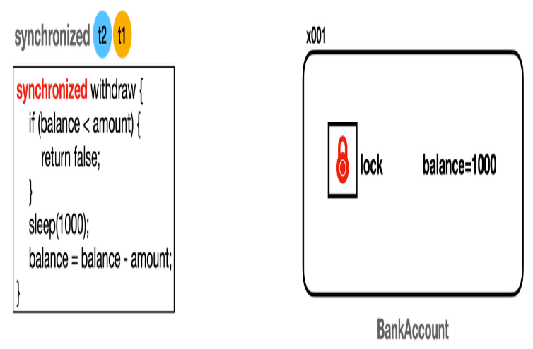

## synchronized

`Account_V2_Main` 의 결과 값을 보자.
```java
09:43:33.894 [       t1] 거래 시작: Account_V2_Impl
09:43:33.900 [       t1] [검증 시작] 출금액: 800, 잔액: 1000
09:43:33.900 [       t1] [검증 완료] 출금액: 800, 잔액: 1000
09:43:34.388 [     main] t1 state: TIMED_WAITING
09:43:34.389 [     main] t2 state: BLOCKED
09:43:34.907 [       t1] [출금 완료] 출금액: 800, 변경 잔액: 200
09:43:34.908 [       t1] 거래 종료
09:43:34.910 [       t2] 거래 시작: Account_V2_Impl
09:43:34.910 [       t2] [검증 시작] 출금액: 800, 잔액: 200
09:43:34.911 [       t2] [검증 실패] 출금액: 800, 잔액: 200
09:43:34.911 [     main] 최종 잔액: 200
```
- 실행 결과를 보면 t1 스레드의 모든 작업이 끝나고 나서, 그 다음에 t2 가 작업을 실행하는 것을 확인할 수 있다.

---

- [사진 출처: 김영한의 실전 자바 - 고급 1편](https://www.inflearn.com/course/%EA%B9%80%EC%98%81%ED%95%9C%EC%9D%98-%EC%8B%A4%EC%A0%84-%EC%9E%90%EB%B0%94-%EA%B3%A0%EA%B8%89-1/dashboard)

모든 객체(인스턴스)는 내부에 자신만의 락(lock)을 가지고 있다.
모니터  락이라고도 부르는 이것은 객체 내부에있고 우리가 직접 확인하기는 어렵다.
스레드는 `synchronized` 키워드가 있는 메서드에 진입하려면
반드시 해당 인스턴스의 락이 있어야 한다.
```java
    @Override
    public synchronized boolean withdraw(int money) {
        log("거래 시작: " + getClass().getSimpleName());

        log("[검증 시작] 출금액: " + money + ", 잔액: " + balance);

        if (balance < money) {
            log("[검증 실패] 출금액: " + money + ", 잔액: " + balance);
            return false;
        }
        log("[검증 완료] 출금액: " + money + ", 잔액: " + balance);
        // 출금 시간
        sleep(1000);
        balance -= money;
        log("[출금 완료] 출금액: " + money + ", 변경 잔액: " + balance);

        log("거래 종료");
        return true;
    }

    @Override
    public synchronized int getBalance() {
        return balance;
    }
```
소스에서 보는 것 처럼 메서드를 호출하므로 이 인스턴스의 락이 필요하다.
`t1`스레드가 먼저 실행된다고 가정했을때 `t2` 의 상태는 `BLOCKED` 상태가 된다.
`BLOCKED` 상태가 되면 CPU 실행 스케줄링에 들어가지 않음
---
## synchronized 장단점
`synchronized` 의 가장큰 장점이자 단점은 한번에 하나의 스레드만 실행 가능하다.
여러 스레드가 동시에 실행하지 못하기 떄문에, 당연히 성능이 떨어질 수 밖에 없다.
그래서 `synchronized` 를 사용할 땐 최소한으로 꼭 동시에 실행할 수 없는 구간에 한정해서 설정해야 한다.


그래서 자바는 `synchronized` 를 메서드 단위가 아닌 특정 코드 블러에 최적화 해서 적용할 수 있는 기능을 제공한다.
`Account_V3_Impl` 클래스를 보면 필요한 부분에만 임계 영역 코드 블럭으로 지정했다.
```java
    @Override
    public boolean withdraw(int money) {
        log("거래 시작: " + getClass().getSimpleName());

        synchronized (this) {
            log("[검증 시작] 출금액: " + money + ", 잔액: " + balance);

            if (balance < money) {
                log("[검증 실패] 출금액: " + money + ", 잔액: " + balance);
                return false;
            }
            log("[검증 완료] 출금액: " + money + ", 잔액: " + balance);
            // 출금 시간
            sleep(1000);
            balance -= money;
            log("[출금 완료] 출금액: " + money + ", 변경 잔액: " + balance);
        }
        log("거래 종료");
        return true;
    }
```
```
// 동시에 시작된 것을 알 수 있음
10:06:17.908 [       t2] 거래 시작: Account_V3_Impl
10:06:17.908 [       t1] 거래 시작: Account_V3_Impl
```
---
### 요약
| 구분   | 장점                                        | 단점                                          |
| ---- | ----------------------------------------- | ------------------------------------------- |
| 사용성  | 언어 차원에서 문법 제공 → 간편하게 사용 가능                | 기능이 단순하여 복잡한 동시성 제어에는 한계                    |
| 락 관리 | 블록/메서드 종료 시 자동으로 락 해제 → 개발자가 직접 관리할 필요 없음 | **무한 대기**: 락이 풀릴 때까지 기다림 (타임아웃 X, 인터럽트 X)   |
| 공정성  | 코드 작성이 단순하여 직관적                           | 어떤 스레드가 락을 얻을지 보장 없음 → 특정 스레드가 오래 기다릴 수도 있음 |
